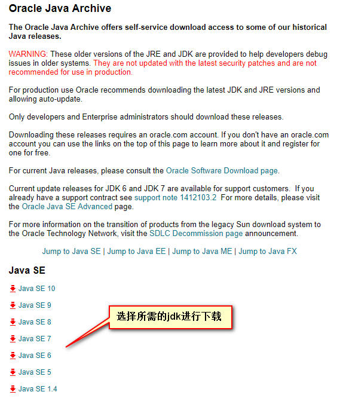

# Java开发环境搭建

#### 一、Java结构

java语言是构建在jdk和jre之上的，jdk包含jre。jre为java的运行提供保证。同时不同平台有相同的jre，所以java才能够实现跨平台。一处编译，处处运行。下图是java平台的体系结构图！

 

#### 二、开始搭建java开发环境

首先到Oracle官网下载java开发环境jdk；下载地址：http://www.oracle.com/technetwork/java/javase/downloads/index.html。目前最新的为10.0，目前大部分使用1.7-1.8。下面介绍历史版本下载方法。

首先打开上面的下载地址。滚动到页面最底部，找到如下图内容。

然后选择所需的jdk进行下载。

历史版本直接访问地址：http://www.oracle.com/technetwork/java/javase/archive-139210.html

#### 三、安装jdk

下面介绍window下的jdk的安装。双击下载的jdk文件。一路next直到最后。如安装过程中没更改默认安装路径，则会在C盘的Program Files\Java下。

配置jdk环境，按下win+r。输入cmd打开dos命令行。输入 java或者javac，如果出现如下界面的内容表示已经配置好了java环境。

报错或者提示不存在，表示没有配置java环境变量， 或者没有配置好。

右键我的电脑，选择属性，打开系统属性，选择高级，点击设置环境变量，在系统变量中添加JAVA_HOME。值为jdk的安装目录。

点击path在其中添加%JAVA_HOME%\bin和%JAVA_HOME%\jre

在次执行开始出介绍的方法检测是否安装完成。至此java开发环境搭建完毕！

[下一节](注释.md)将介绍java中的注释。